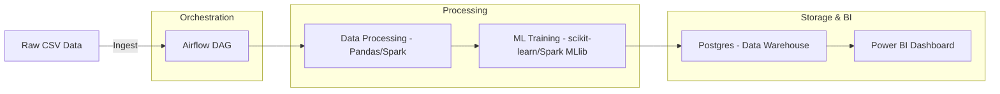

# Airflow + Spark + ML + Power BI Pipeline

## Project Overview
This project demonstrates an **end-to-end data pipeline** combining:
- **Data Engineering**: Orchestration with Apache Airflow, scalable data processing with Apache Spark.  
- **Machine Learning**: Automated model training and evaluation.  
- **Business Intelligence**: Interactive dashboards with Power BI.  

Designed as a **portfolio showcase** for Data Engineering + ML + BI skills.
---

## Architecture

---
## Features

Data Ingestion
- Load raw CSVs into the pipeline.

- Process data with Pandas or Apache Spark.

Machine Learning

- Train models (e.g., Logistic Regression).

- Store metrics and results in Postgres.

Data Warehouse

- Postgres stores processed data + ML outputs.

BI Dashboard

- Power BI connects to Postgres for insights.

Orchestration

- Airflow manages ETL, Spark jobs, and ML workflows.
---
## Tech Stack

- Apache Airflow (orchestration)

- Apache Spark (big data processing)

- Postgres (data warehouse)

- scikit-learn (ML models)

- Power BI (dashboards)

- Docker Compose (deployment)

---
Setup Instructions

1. Clone repo:
    git clone https://github.com/yourusername/airflow-spark-ml-bi-pipeline.git
    cd airflow-spark-ml-bi-pipeline

2. Start environment:
    docker compose up -d

3. Initialize Airflow:

    docker compose exec airflow-webserver airflow db init
    docker compose exec airflow-webserver airflow users create --username admin --password admin --role Admin --firstname Air --lastname Flow --email admin@example.com

    Access Airflow UI → http://localhost:8080
    Access Spark Master UI → http://localhost:8081
---

## Example DAGs

    csv_to_postgres.py → Load & clean CSV into Postgres.
    ml_training.py → Train ML model & store results.
    spark_etl.py → Run scalable Spark transformations.

## Power BI

    Connects directly to Postgres.
    Example dashboards:
    Data pipeline health.
    ML model performance.
    Business KPIs.

## Future Improvements

    Add cloud storage integration (AWS S3 / GCS).
    Deploy ML model with FastAPI + Airflow inference DAG.
    Extend BI to cloud warehouses (Snowflake / BigQuery).
